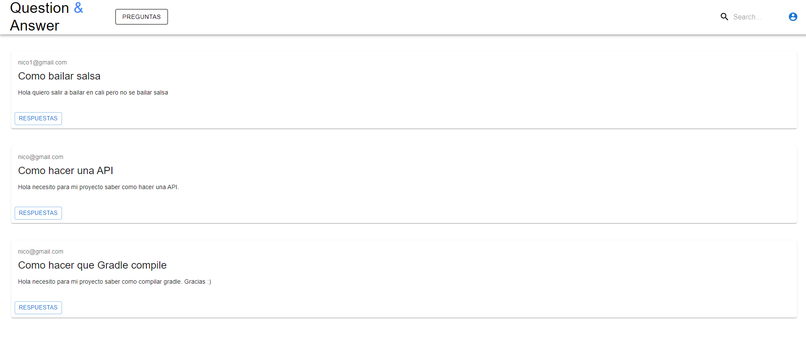
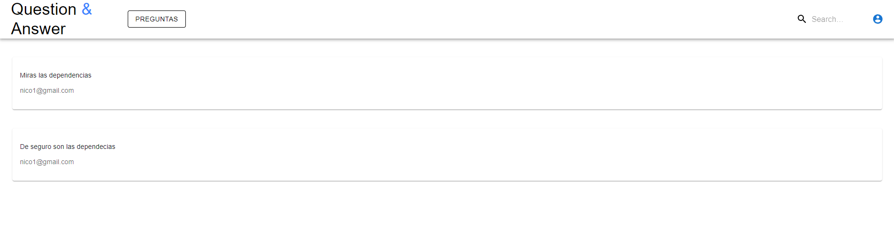

# Question Answer Test
## Autor
**Nikolai Bermudez Vega**  
## Resumen
El objetivo es construir una aplicación Simple de Questions & Answers con funcionalidad básica al estilo  StackOverflow
## Prerequisitos
Tener instalado:
- Node.js.

Entender sobre peticiones http, docker (contenedores), servidores y demás, así como el lenguaje JAVA en el que fue realizado este proyecto.

## ¿Cómo usar el aplicativo?
Descargue o clone el repositorio con el siguiente comando.

    git clone https://github.com/Nikolai9906/Questions-Answer---Test-Front

Luego abra el proyecto con su entorno de desarrollo preferido ( Se recomienda Visual Studio Code)

Compile las dependecias que le pedira el proyecto con el siguiente comando

    npm install

Por ultimo corralo con ayuda de la terminal con el siguiente comando

    npm start

**TENER EN CUENTA:** Para que el proyecto funcione correctamente hay que tener corriendo simultáneamente los dos proyectos tanto el backend como el frontend

Proyecto Backend

https://github.com/Nikolai9906/Questions-Answer---Test

## Operaciones
Podremos realizar multiples acciones como:
- Usuarios sin ingresar:
  - Ver preguntas
  - Ver respuestas

- Usuarion ya ingresados:
  - Ver preguntas
  - Ver respuestas
  - Hacer preguntas
  - Hacer respuestas

## Pruebas
### Home de la aplicacion

### Vista de respuesta vacias

### Vista de respuestas

## Tecnologias y herramientas
- [Mui](https://mui.com) Libreria de componentes

- [Axios](https://www.npmjs.com/package/axios) Librería JavaScript que puede ejecutarse en el navegador y que nos permite hacer sencillas las operaciones como cliente HTTP

## Construido
- [Nodejs](https://nodejs.org/es/) Entorno de ejecucion para JavaScript

- [Visual Studio Code](https://code.visualstudio.com) Editor de Nodejs donde se puede ejecutar el proyecto

- [Docker](https://www.docker.com/) Administrador de contenedores.

## Licencia
Este programa es de uso libre, puede ser usado por cualquier persona.

Los terminos de la licencia se pueden encontrar en el siguiente archivo [License](LICENSE).
